# Relationship Basics

## Real World Data Is Messy and Interrelated

### Relationship Basics

This is not marriage counseling

- One to One Relationship
- One to Many Relationship
- Many to Many Relationship

### Example Book Store

## 

---

## One To Many

1:MANY

The Most Common Relationship

CUSTOMERS & ORDERS

## We Want To Store

- A customer's first and last name
- A customer's email
- The date of the purchase
- The price of the order
- We Want To Store

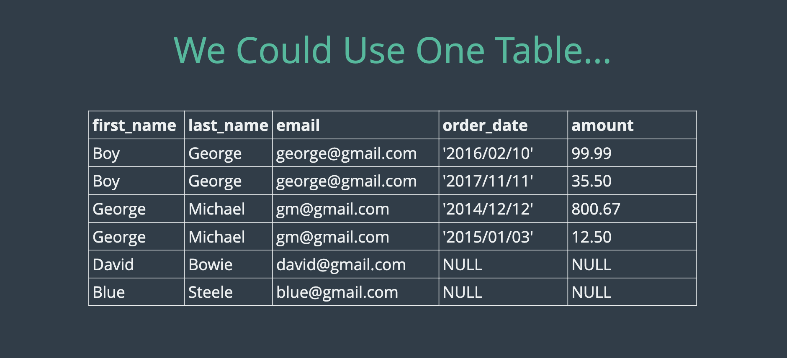

## Not a good Idea to use One Table.

---

## **Simple Approach to One to Many Table**

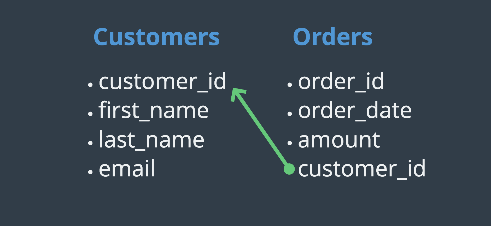

---

## Customer and Order Tables

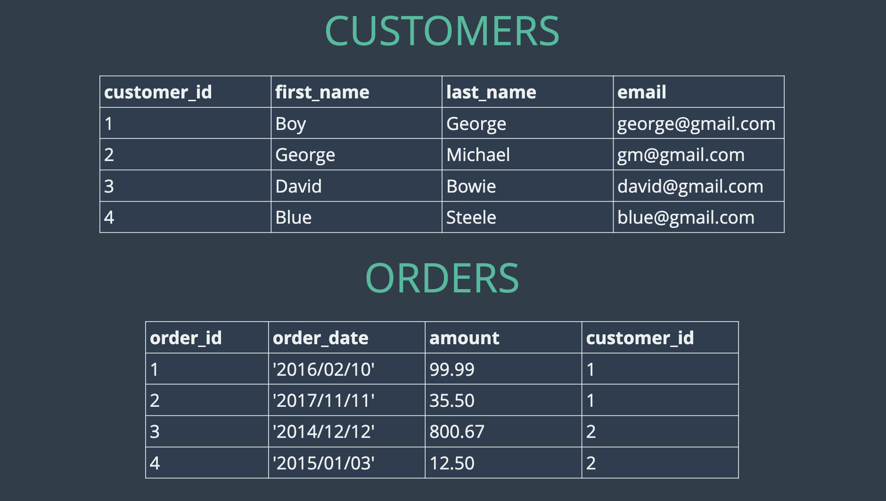

---

### PRIMARY KEY

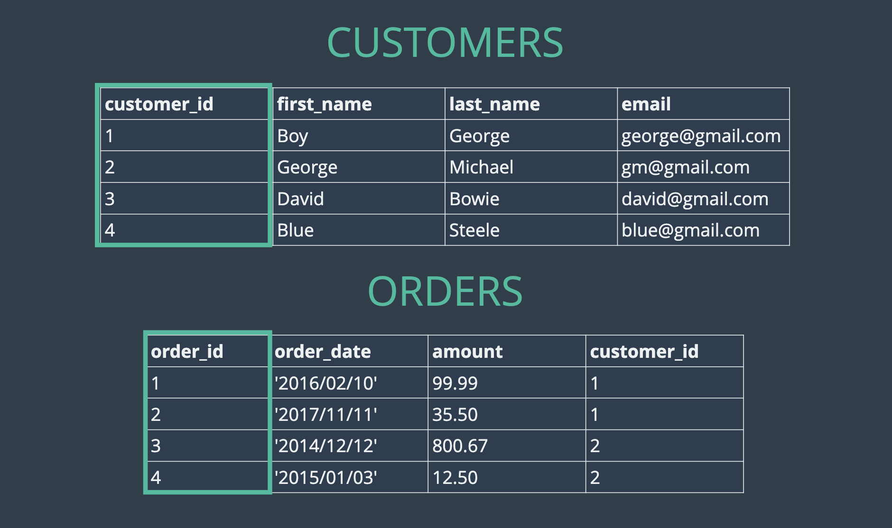

---

### FOREIGNKEY

customer_id is a foreign key.
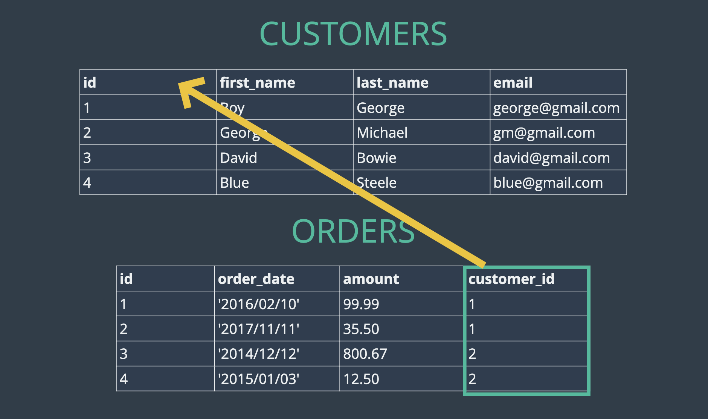

---

### Let's Get Coding!

Create Customer Table.

```sql
CREATE TABLE customers(
    id INT AUTO_INCREMENT PRIMARY KEY,
    first_name VARCHAR(100),
    last_name VARCHAR(100),
    email VARCHAR(100)
);
```

Create Order Table.

```sql
CREATE TABLE orders(
    id INT AUTO_INCREMENT PRIMARY KEY,
    order_date DATE,
    amount DECIMAL(8,2),
    customer_id INT,
    FOREIGN KEY(customer_id) REFERENCES customers(id)
);
```

### Insert Customers data

```sql
INSERT INTO customers (first_name, last_name, email)
VALUES ('Boy', 'George', 'george@gmail.com'),
       ('George', 'Michael', 'gm@gmail.com'),
       ('David', 'Bowie', 'david@gmail.com'),
       ('Blue', 'Steele', 'blue@gmail.com'),
       ('Bette', 'Davis', 'bette@aol.com');

```

### Insert Orders data

```sql
INSERT INTO orders (order_date, amount, customer_id)
VALUES ('2016/02/10', 99.99, 1),
       ('2017/11/11', 35.50, 1),
       ('2014/12/12', 800.67, 2),
       ('2015/01/03', 12.50, 2),
       ('1999/04/11', 450.25, 5);
```

---

## **JOIN Tables**

### CROSSS JOIN

```sql
SELECT * FROM Customers,Orders;
```

```sql
SELECT *
FROM Customers,Orders
WHERE Customers.id=Orders.customer_id;
```

### **INNER JOIN**

The `INNER JOIN` keyword selects records that have matching values in both tables.

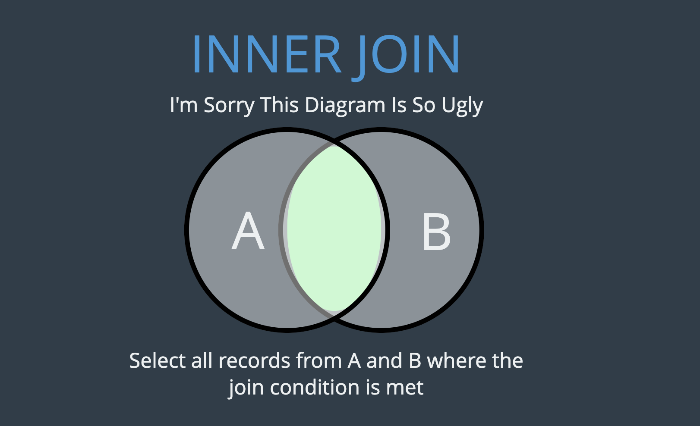

### IMPLICIT INNER JOIN

```sql
SELECT *
FROM Customers,Orders
WHERE Customers.id=Orders.customer_id;
```

#### Selected Columns

```sql
SELECT first_name,last_name,email,order_date,amount
FROM Customers,Orders
WHERE Customers.id=Orders.customer_id;
```

### EXPLICIT INNER JOIN

```sql
SELECT *
FROM Customers
JOIN Orders ON Customers.id = Orders.customer_id;
```

#### Selected Columns

```sql
SELECT first_name,last_name,email,order_date,amount
FROM Customers
JOIN Orders ON Customers.id = Orders.customer_id;
```

### More fun with Order By

```sql
SELECT first_name,last_name,email,order_date,amount
FROM Customers
JOIN Orders
  ON Customers.id = Orders.customer_id
ORDER BY order_date;
```

### More fun with Group By

```sql
SELECT first_name,last_name,email,order_date,amount
FROM Customers
JOIN Orders
  ON Customers.id = Orders.customer_id
GROUP BY Orders.customer_id;
```

### More fun with Group By with SUM function

```sql
SELECT
  first_name,
  last_name,
  email,
  ANY_VALUE(order_date),
  SUM(amount) AS total_spent
FROM Customers
JOIN orders
  ON Customers.id = orders.customer_id
GROUP BY orders.customer_id;
```

### More fun with Group By with SUM and ORDER BY

```sql
SELECT
  customers.id,
  first_name,
  last_name,
  email,
  SUM(amount) AS total_spent
FROM Customers
JOIN orders
  ON Customers.id = orders.customer_id
GROUP BY orders.customer_id
ORDER BY total_spent DESC;
```

---

## LEFT JOIN

The `LEFT JOIN` keyword returns all records from the left table (table1), and the matching records from the right table (table2).

The result is 0 records from the right side, if there is no match.

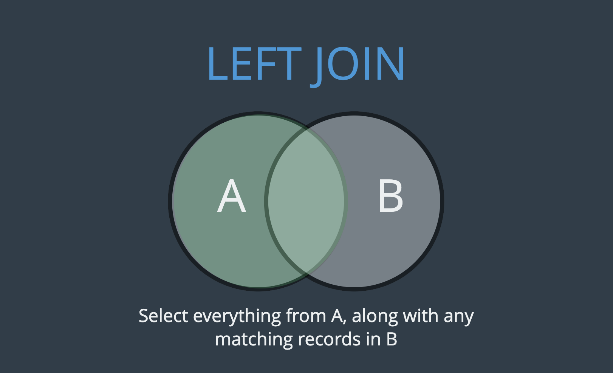

```sql
LEFT JOIN Syntax
SELECT column_name(s)
FROM table1
LEFT JOIN table2
ON table1.column_name = table2.column_name;
```

### Basic Left Join

```sql
SELECT *
    FROM Customers
    LEFT JOIN Orders
       ON customers.id=Orders.customer_id;
```

```sql
SELECT
  first_name,
  last_name,
  amount
FROM Customers
LEFT JOIN orders
  ON Customers.id = orders.customer_id;
```

### Find who spent most or nothing .

```sql
SELECT
  first_name,
  ANY_VALUE(last_name),
  SUM(amount)
FROM Customers
LEFT JOIN orders
  ON Customers.id = orders.customer_id
GROUP BY customers.id;
```

### Using IFNULL to fill Null value with 0.00

```sql
SELECT
  customers.id,
  first_name,
  ANY_VALUE(last_name),
  IFNULL(SUM(amount),0) AS total_spent
FROM Customers
LEFT JOIN Orders
    ON Customers.id = Orders.customer_id
GROUP BY Customers.id
ORDER BY total_spent;
```

---

## Right JOIN

## SQL RIGHT JOIN Keyword

The `RIGHT JOIN` keyword returns all records from the right table (table2), and the matching records from the left table (table1).

The result is 0 records from the left side, if there is no match.

```sql
RIGHT JOIN Syntax
SELECT column_name(s)
FROM table1
RIGHT JOIN table2
ON table1.column_name = table2.column_name;
```

```sql
SELECT
  first_name,
  last_name,
  ANY_VALUE(order_date),
  IFNULL(SUM(amount),0) AS total_spent
FROM Customers
RIGHT JOIN Orders
    ON Customers.id = Orders.customer_id
GROUP BY Customers.id
ORDER BY total_spent;
```

### Handling Missing Data of other talbes

```sql
SELECT
  IFNULL(first_name,'Unknow') AS first_name,
  IFNULL(last_name,'Customer') AS last_name,
  ANY_VALUE(order_date),
  IFNULL(SUM(amount),0) AS total_spent
FROM Customers
RIGHT JOIN Orders
    ON Customers.id = Orders.customer_id
GROUP BY Customers.id
ORDER BY total_spent;
```

---

## Exercise Time

```sql
CREATE TABLE Students(
  id INT AUTO_INCREMENT PRIMARY KEY,
  first_name VARCHAR(100)
);
```

```sql
CREATE TABLE Papers(
  title VARCHAR(100),
  grade INT,
  student_id INT,
  FOREIGN KEY(student_id)
        REFERENCES Students(id)
        ON CASECADE
);
```

### Insert Data

```sql

INSERT INTO students (first_name) VALUES
('Caleb'), ('Samantha'), ('Raj'), ('Carlos'), ('Lisa');

INSERT INTO papers (student_id, title, grade ) VALUES
(1, 'My First Book Report', 60),
(1, 'My Second Book Report', 75),
(2, 'Russian Lit Through The Ages', 94),
(2, 'De Montaigne and The Art of The Essay', 98),
(4, 'Borges and Magical Realism', 89);

```

### Exercise 1

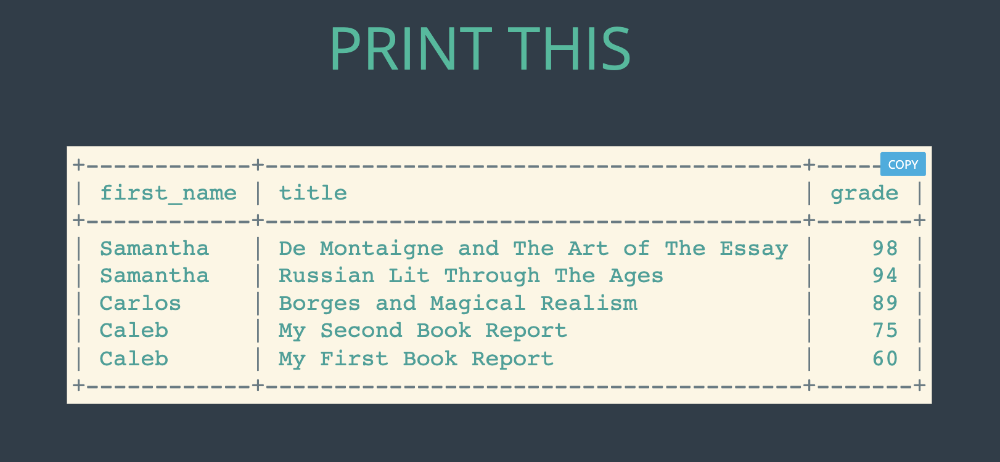

```sql
SELECT
  first_name,
  title,
  grade
FROM Students
INNER  JOIN Papers
  ON  Students.id = Papers.student_id
ORDER BY grade DESC;
```

### ALT Solution

Right JOIN since every papers is belong to each Student

```sql
SELECT
  first_name,
  title,
  grade
FROM Students
RIGHT  JOIN Papers
  ON  Students.id = Papers.student_id
ORDER BY grade DESC;
```

---

### Exercise 2

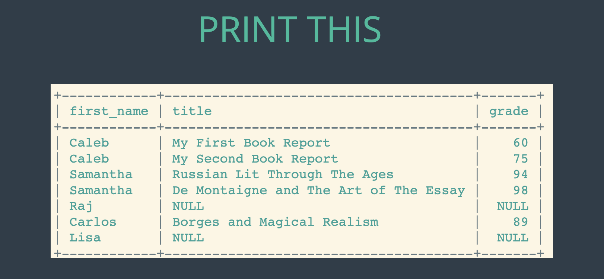

```sql
SELECT
   first_name,
   title,
   grade
FROM Students
LEFT JOIN Papers
    ON Students.id = Papers.student_id;
```

---

### Exercise 3

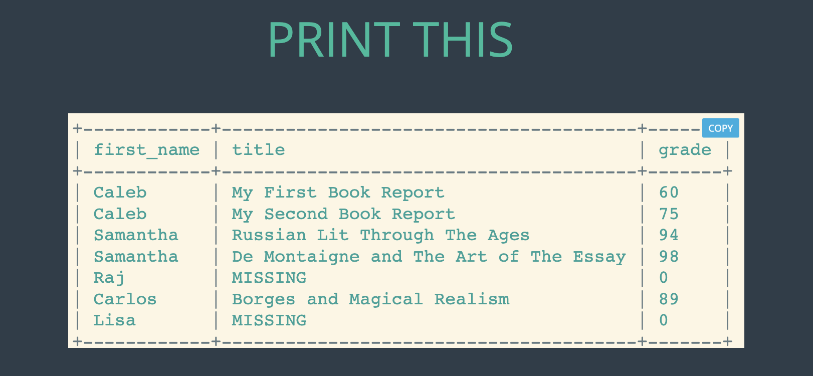

```sql
SELECT
     first_name,
     IFNULL(title,'MISSING') AS title,
     IFNULL(grade,0) As Grade
FROM Students
LEFT JOIN Papers
      ON students.id=Papers.student_id;
```

### Exercise 4

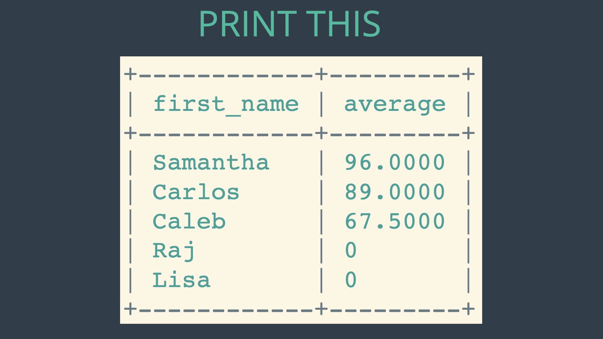

```sql
SELECT
   ANY_VALUE(first_name),
   IFNULL(avg(grade),0) AS Average
FROM Students
LEFT JOIN Papers
   ON Students.id = Papers.student_id
GROUP BY Students.id
ORDER BY Average DESC;
```

### Exercise 5

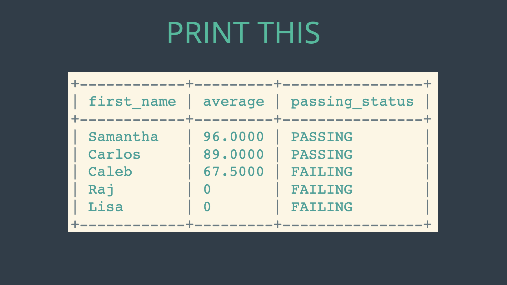

```sql
SELECT
   ANY_VALUE(first_name),
   IFNULL(avg(grade),0) AS Average,
   CASE
        WHEN AVG(grade) >= 75 THEN 'PASSING'
        ELSE 'FAILING'
   END AS Passing_status
FROM Students
LEFT JOIN Papers
   ON Students.id = Papers.student_id
GROUP BY Students.id
ORDER BY Average DESC;
```

### Handling Null value for Average

```sql
SELECT
   ANY_VALUE(first_name),
   IFNULL(avg(grade),0) AS Average,
   CASE
        WHEN AVG(grade) IS NULL THEN 'FAILING'
        WHEN AVG(grade) >= 75 THEN 'PASSING'
        ELSE 'FAILING'
   END AS Passing_status
FROM Students
LEFT JOIN Papers
   ON Students.id = Papers.student_id
GROUP BY Students.id
ORDER BY Average DESC;
```
