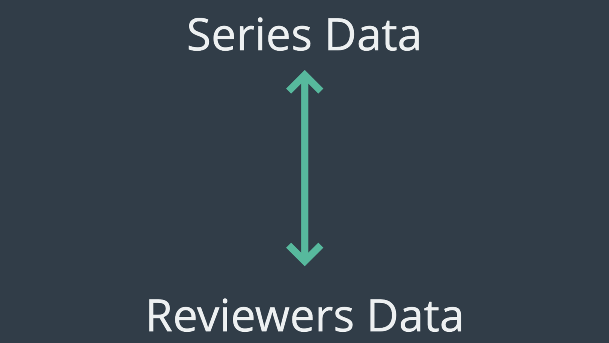
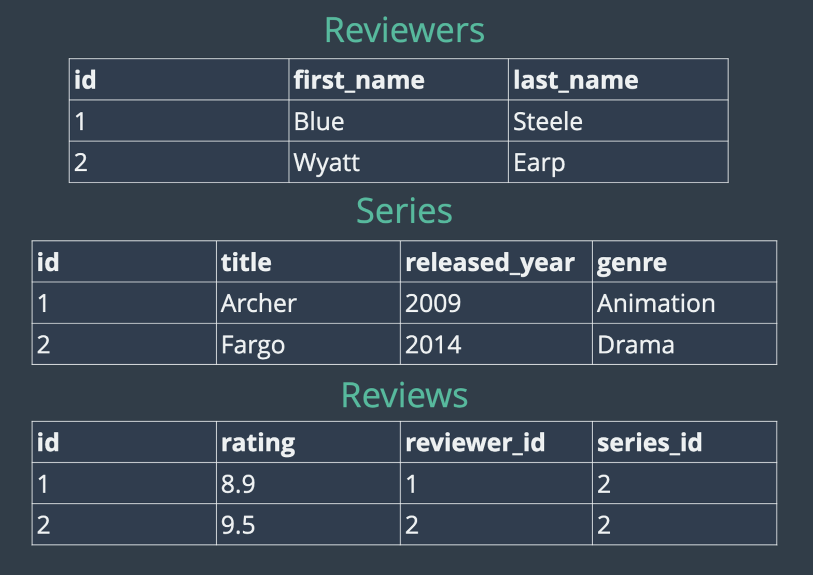
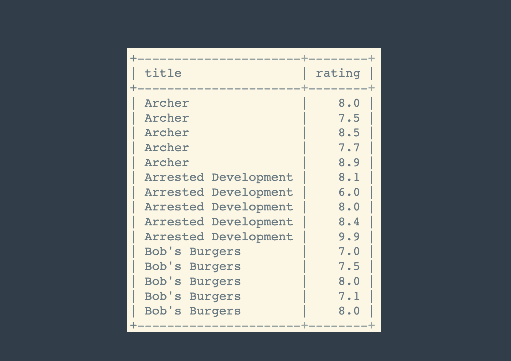
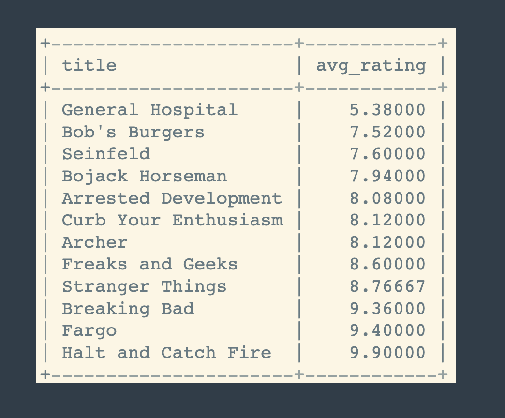
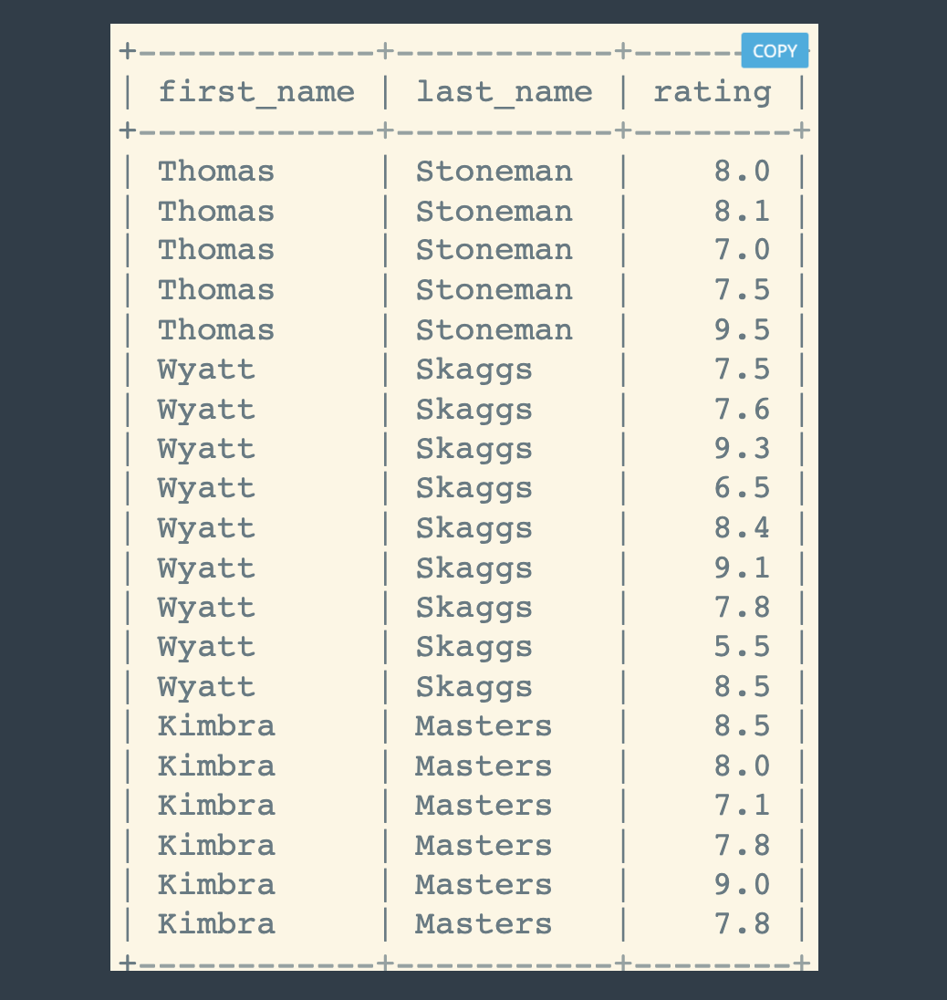
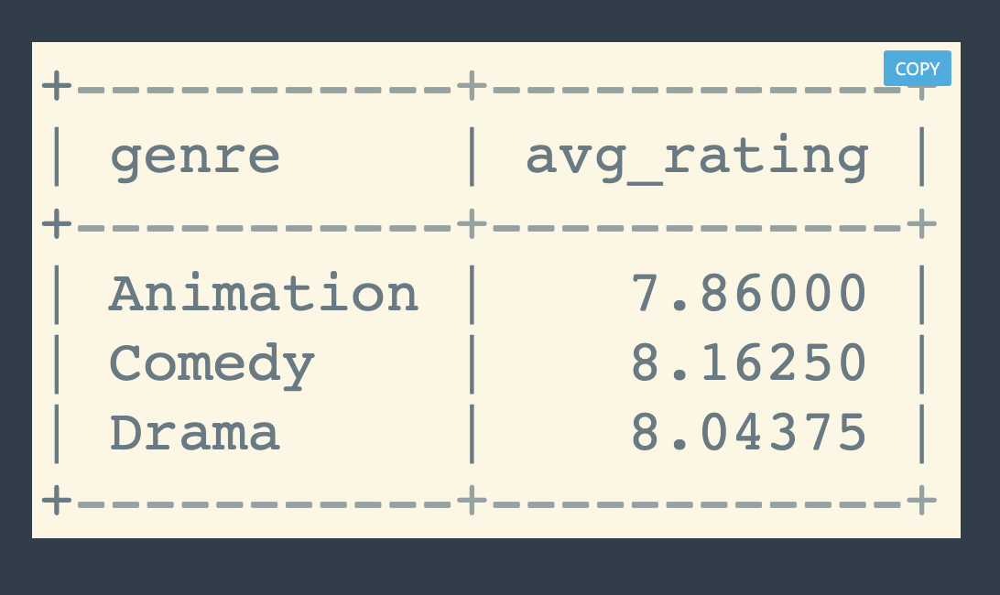
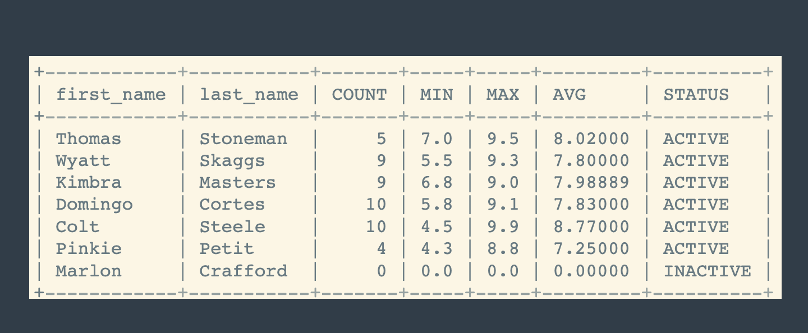
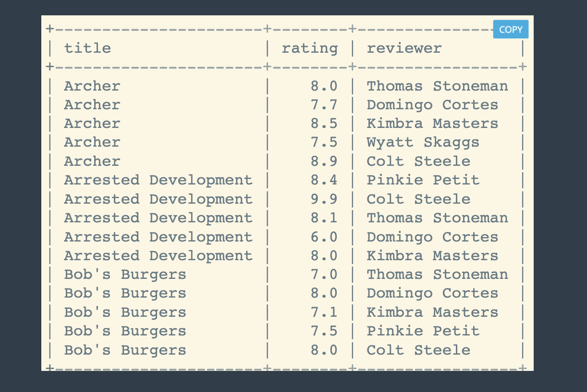

# Many To Many Relationship

## **MANY:MANY**

The Tiny Bit Trickier Relationship


---

## Another Example

Imagine we're building a tv show reviewing application



## TV Series Table Structure


## TV Series Data With Tables



---

## Creating Table

### Reviewers Table

```sql

CREATE TABLE Reviewers(
  id INT AUTO_INCREMENT PRIMARY KEY,
  first_name VARCHAR(100),
  last_name VARCHAR(100)
);
```

### Series Table

```sql

CREATE TABLE Series(
  id INT AUTO_INCREMENT PRIMARY KEY,
  title VARCHAR(100),
  released_year YEAR(4),
  genre VARCHAR(100)
);
```

## Insert TV Series Data

### Series Data

```sql
INSERT INTO series (title, released_year, genre) VALUES
    ('Archer', 2009, 'Animation'),
    ('Arrested Development', 2003, 'Comedy'),
    ("Bob's Burgers", 2011, 'Animation'),
    ('Bojack Horseman', 2014, 'Animation'),
    ("Breaking Bad", 2008, 'Drama'),
    ('Curb Your Enthusiasm', 2000, 'Comedy'),
    ("Fargo", 2014, 'Drama'),
    ('Freaks and Geeks', 1999, 'Comedy'),
    ('General Hospital', 1963, 'Drama'),
    ('Halt and Catch Fire', 2014, 'Drama'),
    ('Malcolm In The Middle', 2000, 'Comedy'),
    ('Pushing Daisies', 2007, 'Comedy'),
    ('Seinfeld', 1989, 'Comedy'),
    ('Stranger Things', 2016, 'Drama');
```

### Reviewers Data

```sql
INSERT INTO reviewers (first_name, last_name) VALUES
    ('Thomas', 'Stoneman'),
    ('Wyatt', 'Skaggs'),
    ('Kimbra', 'Masters'),
    ('Domingo', 'Cortes'),
    ('Colt', 'Steele'),
    ('Pinkie', 'Petit'),
    ('Marlon', 'Crafford');
```

## Create Reviews Table

```sql
CREATE TABLE Reviews (
	 id INT AUTO_INCREMENT PRIMARY KEY,
     rating DECIMAL(2,1),
     series_id INT,
     reviewer_id INT,
     FOREIGN KEY(series_id) REFERENCES Series(id),
     FOREIGN KEY(reviewer_id) REFERENCES Reviewers(id)

);

```

### Insert Reviews Data

```sql
INSERT INTO reviews(series_id, reviewer_id, rating) VALUES
    (1,1,8.0),(1,2,7.5),(1,3,8.5),(1,4,7.7),(1,5,8.9),
    (2,1,8.1),(2,4,6.0),(2,3,8.0),(2,6,8.4),(2,5,9.9),
    (3,1,7.0),(3,6,7.5),(3,4,8.0),(3,3,7.1),(3,5,8.0),
    (4,1,7.5),(4,3,7.8),(4,4,8.3),(4,2,7.6),(4,5,8.5),
    (5,1,9.5),(5,3,9.0),(5,4,9.1),(5,2,9.3),(5,5,9.9),
    (6,2,6.5),(6,3,7.8),(6,4,8.8),(6,2,8.4),(6,5,9.1),
    (7,2,9.1),(7,5,9.7),
    (8,4,8.5),(8,2,7.8),(8,6,8.8),(8,5,9.3),
    (9,2,5.5),(9,3,6.8),(9,4,5.8),(9,6,4.3),(9,5,4.5),
    (10,5,9.9),
    (13,3,8.0),(13,4,7.2),
    (14,2,8.5),(14,3,8.9),(14,4,8.9);
```

### Exercise 1


Query all tv series which have review rating.
Select title,rating from Series and Reviews Tables.

```sql
SELECT
	title,
  rating
FROM Series
INNER JOIN Reviews
	ON  Series.id= Reviews.series_id;
```

### Exercise 2



```SQL
SELECT
	title,
    avg(rating) AS avg_rating
FROM Series
JOIN Reviews
	ON Series.id=Reviews.series_id
GROUP BY Series.id
ORDER BY avg_rating;
```

### Exercise 3



```sql

SELECT
		first_name,
		last_name,
        rating,
FROM Reviewers
JOIN Reviews
	ON Reviewers.id = Reviews.reviewer_id;
```

```sql
SELECT
		first_name,
		last_name,
        ANY_VALUE(rating) AS rating,
        COUNT(Reviewers.id) AS num_of_vote
FROM Reviewers
JOIN Reviews
	ON Reviewers.id = Reviews.reviewer_id
GROUP BY Reviewers.id;
```

---

### Exercise 4


```sql
SELECT
	title AS unreviewed_series
FROM series
LEFT JOIN reviews
	ON series.id = reviews.series_id
WHERE rating IS NULL;
```

---

### Exercise 5



```sql
SELECT
	ANY_VALUE(genre),
    ROUND(AVG(rating),2) AS avg_ratings
FROM Series
INNER JOIN Reviews
	ON Series.id = Reviews.series_id
GROUP BY genre;
```

---

### Exercise 6



```sql
SELECT
	first_name,
    ANY_VALUE(last_name) AS last_name,
    COUNT(rating) AS Count,
    IFNULL(MIN(rating),0) AS MIN,
    IFNULL(MAX(rating),0) AS MAX,
    ROUND(IFNULL(AVG(rating),0)) AS AVG,
    CASE
		WHEN COUNT(rating) >= 10 THEN 'Power User'
        WHEN COUNT(rating) >0 THEN 'ACTIVE'
        ELSE 'INACTIVE'
    END AS STATUS
FROM Reviewers
LEFT JOIN Reviews
	ON Reviewers.id = Reviews.reviewer_id
GROUP BY Reviewers.id;
```

---

### Exercise 7



```sql
SELECT
	title,
    rating,
    concat(first_name, ' ', last_name ) As reviwer
FROM reviewers
INNER JOIN Reviews
	ON Reviewers.id = Reviews.reviewer_id
INNER JOIN Series
	ON Reviews.series_id = Series.id
ORDER BY title;
```
